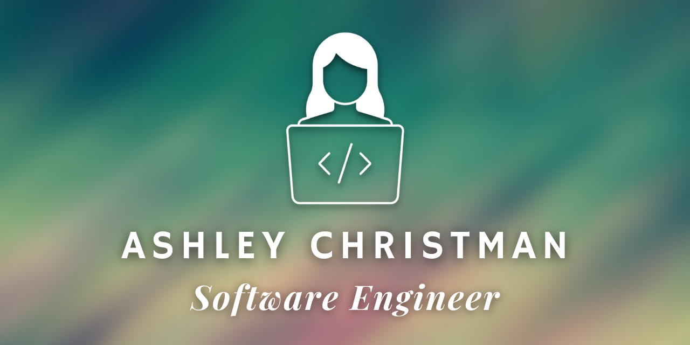

# My Personal Portfolio

Portfolio site including links to my projects and ways to get in contact with me.

**Link to project:** http://ashleychristman.com/

## How It's Made:

**Tech used:** HTML, CSS, JavaScript

My focus for this project was building a page that showcases my passion for engineering in a simple, concise manner. 

## Optimizations

When I update my portfolio I will be focusing on adding more animations and additional projects, along with improving accessibility. 

## Lessons Learned:

My portfolio taught me a lot about the importance of separation of concerns and progressive enhancement. 

